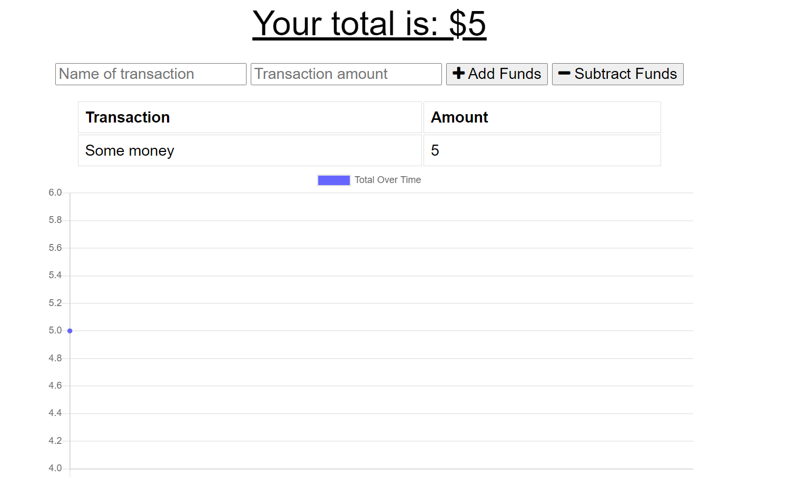

# PWA Budget Tracker

[See the site in action!](https://pwa-budget-app-wijeremy.herokuapp.com/)

## Description

I built this project to test applying the PWA archetecture to an app.
This app can track your budget and expenses.
I learned a lot about PWAs, but I also learned a lot about implementing mongoDB in a heroku app.

## Table of Contents

- [Installation](#installation)
- [Usage](#usage)
- [License](#license)
- [Contributing](#contributing)
- [Tests](#tests)
- [Questions](#questions)

## Installation

The app should run on heroku, but if you download yourself, to run it on your personal computer, either uncomment the local host lines in server.js or employ dotenv and and env file containing your mongo atlas account information.

## Usage

Use any time you need to balance your budget.

## License

I am using [MIT](https://opensource.org/licenses/MIT) to license this app.

## Contributing

See license.

## Tests

No tests provided.

## Questions?

Email me at jeremydavwilliams@gmail.com or visit [my github page](github.com/wijeremy)
